# Site Availability Checker
---
https://solvit.space/projects/uptime_monitor
---
**Service for monitoring website availability.**

---

### 🛠 Tech Stack

- **Backend**: Python 3.12 + FastAPI
- **Frontend**: React
- **Authentication**: Google OAuth 2.0
- **Database**: PostgreSQL + Alembic
- **Queue & Tasks**: RabbitMQ + Taskiq
- **Deployment**: Docker + Docker Compose

---

### 🚀 Quick Start

---
```bash
docker compose up --build
```

### 🧪 Testing

```bash
docker compose run --rm backend_api uv run pytest -v
```

### 📸 User Interface Showcase

| Login Page | Signup Page | Main Dashboard |
|------------|-------------|----------------|
| 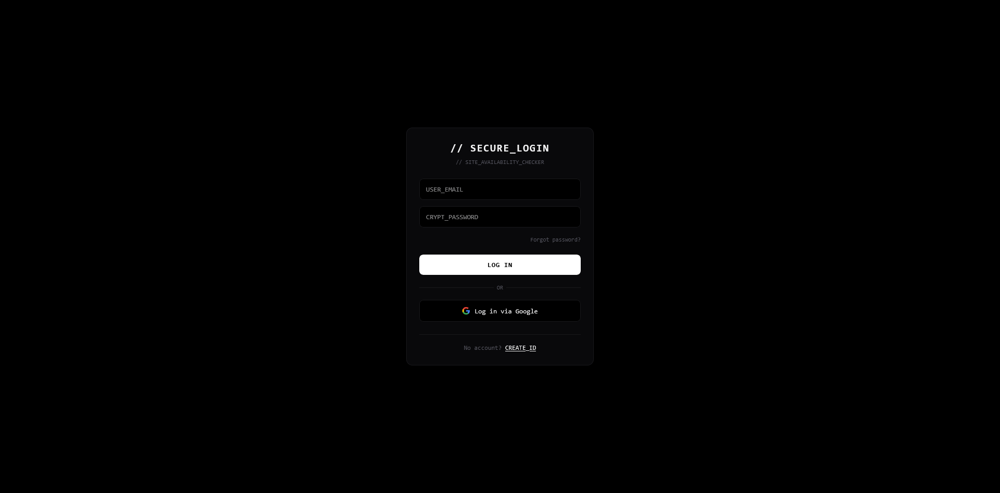 | 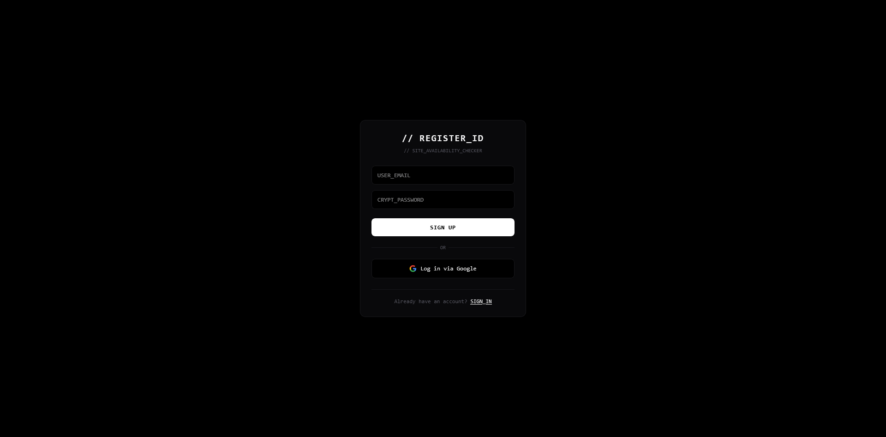 | 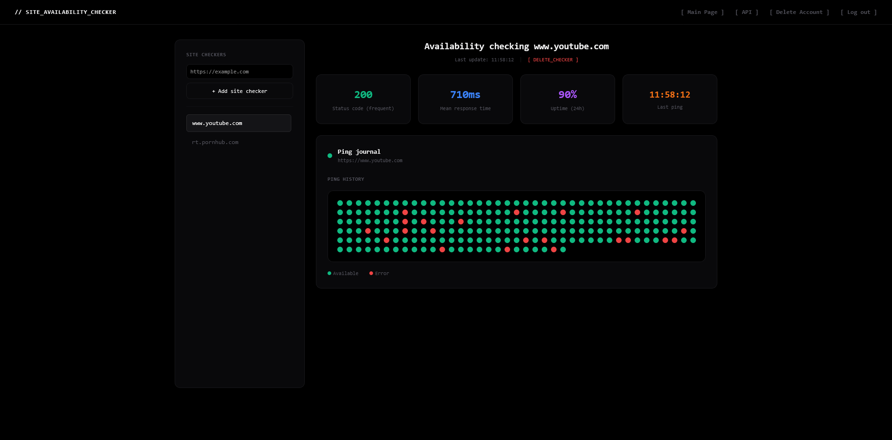 |

| Password Reset Request | Password Reset Confirm | Account Deletion (OTP) | Account Deletion (Success) |
|------------------------|------------------------|------------------------|----------------------------|
| 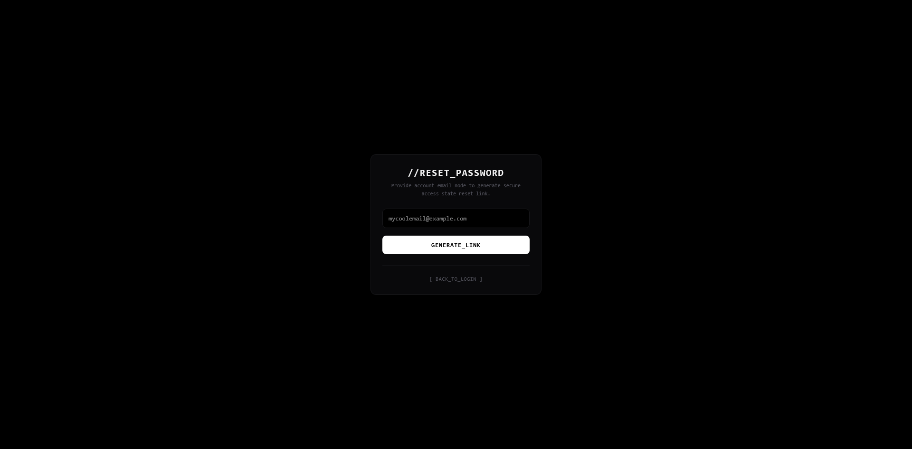 | 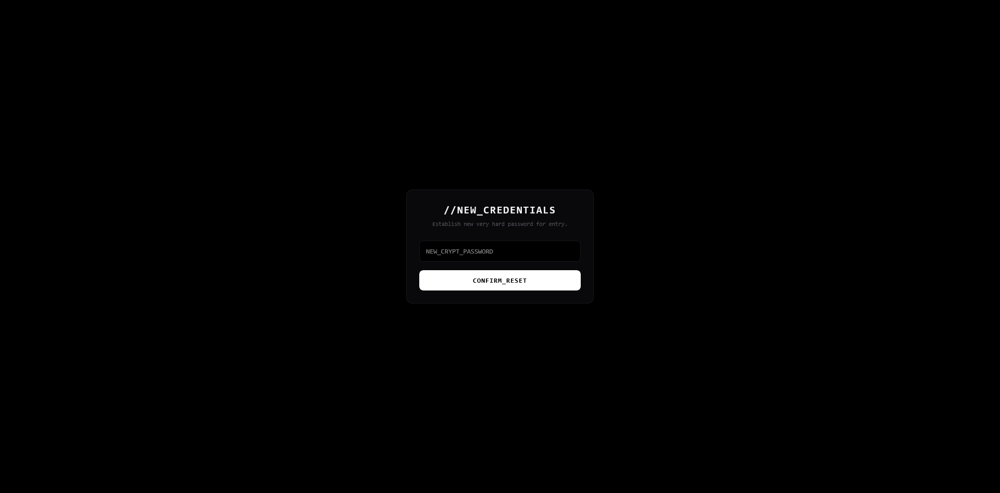 | 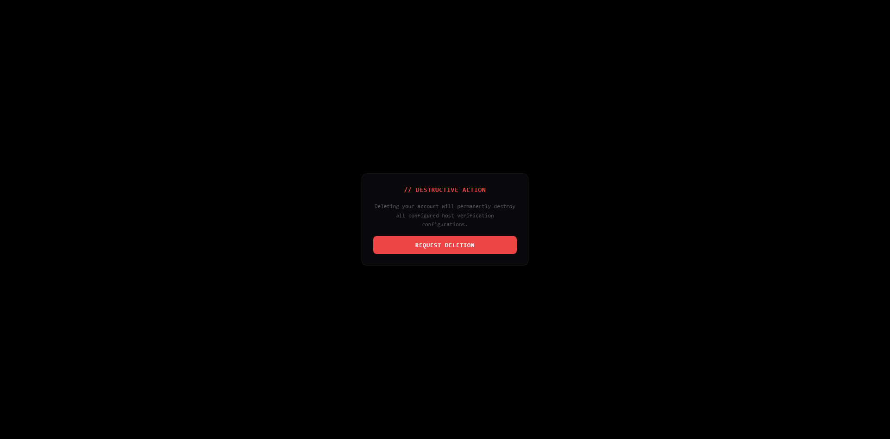 | 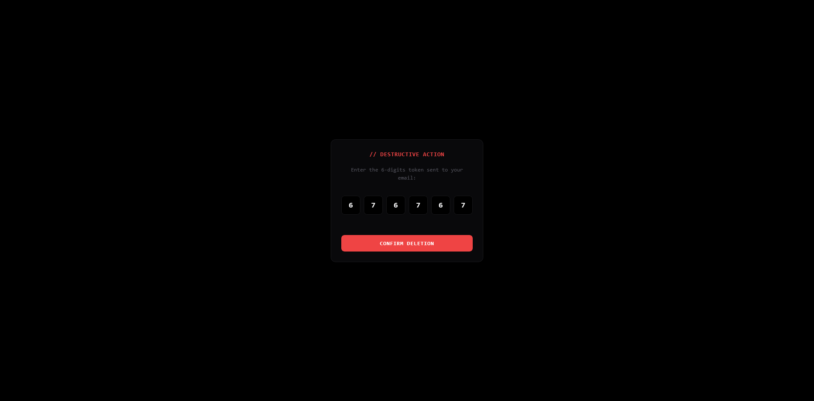 |

| API Keys Page | API Docs Page |
|---------------|---------------|
| 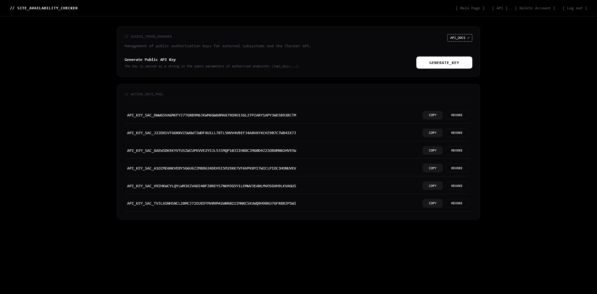 | 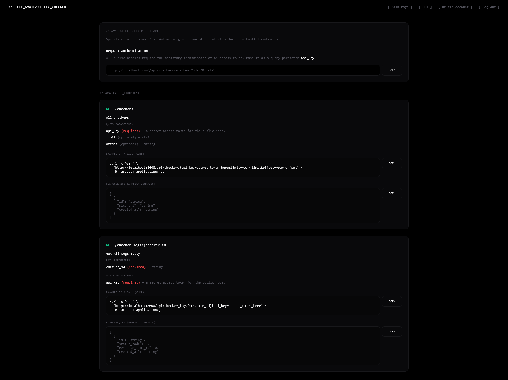 |

| Main Swagger | Public API Swagger |
|--------------|--------------------|
| 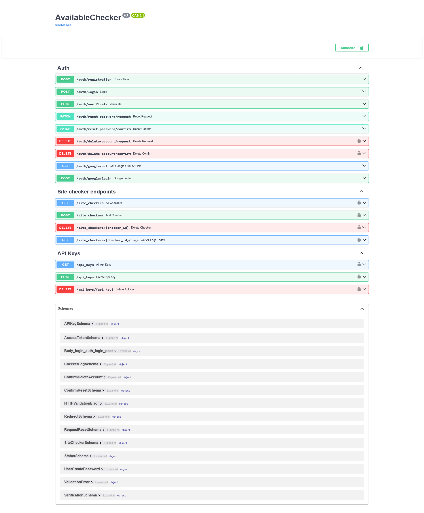 | 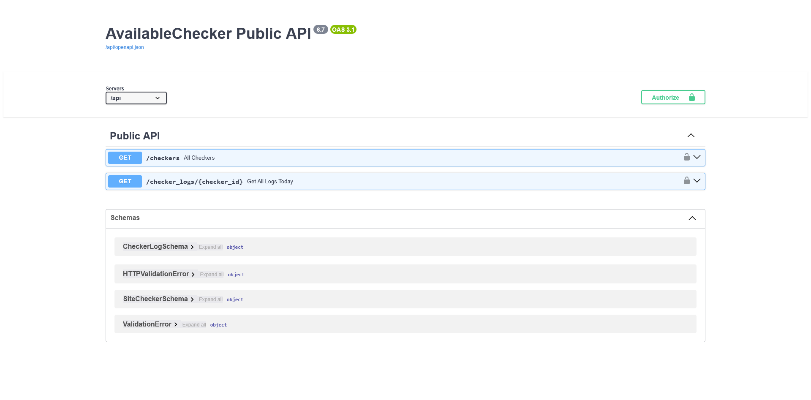 |
